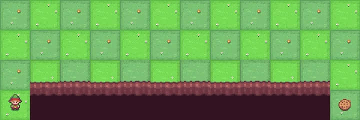
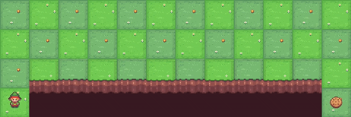

# Cliff Walking with SARSA and Q-Learning

This project explores **Reinforcement Learning** by implementing two algorithms — **SARSA** and **Q-Learning** — in the Cliff Walking environment.

The goal of the agent is to move from the **start position to the goal** while avoiding the cliff. If the agent steps into the cliff, it receives a large negative reward and returns to the starting position.

By implementing both algorithms, this project demonstrates how different reinforcement learning strategies affect the behaviour of an agent.

## Environment

The Cliff Walking environment is a grid world where:

* The agent starts at the bottom-left corner
* The goal is at the bottom-right corner
* The cells between them represent a cliff
* Falling into the cliff gives a large negative reward

The agent must learn the best path to reach the goal efficiently.

## SARSA Implementation

SARSA is an **on-policy reinforcement learning algorithm**. It updates its knowledge using the action that the agent actually takes according to its current policy.

Because of this learning strategy, the agent tends to learn a **safer path** that stays farther away from the cliff.

### Agent behaviour using SARSA

## Q-Learning Implementation

Q-Learning is an **off-policy reinforcement learning algorithm**. Instead of following the current action policy strictly, it learns by considering the **best possible action** from the next state.

This allows the agent to eventually learn the **optimal path** from the start to the goal.

### Agent behaviour using Q-Learning

## Key Observation

Running both algorithms on the same environment reveals an interesting difference:

* **SARSA** learns a safer route that avoids getting too close to the cliff
* **Q-Learning** eventually finds the **optimal shortest path** to reach the goal

This comparison helps build an intuitive understanding of how different reinforcement learning strategies influence agent behaviour.

## What I Learned

* Reinforcement learning fundamentals
* Temporal difference learning
* Differences between on-policy and off-policy learning
* Training an agent in a grid-based environment

## Author

Amrita Chaturvedi
B.Tech Computer Science and Engineering
Exploring Machine Learning and Reinforcement Learning
